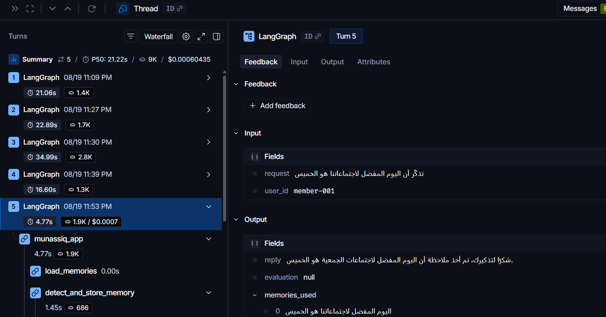
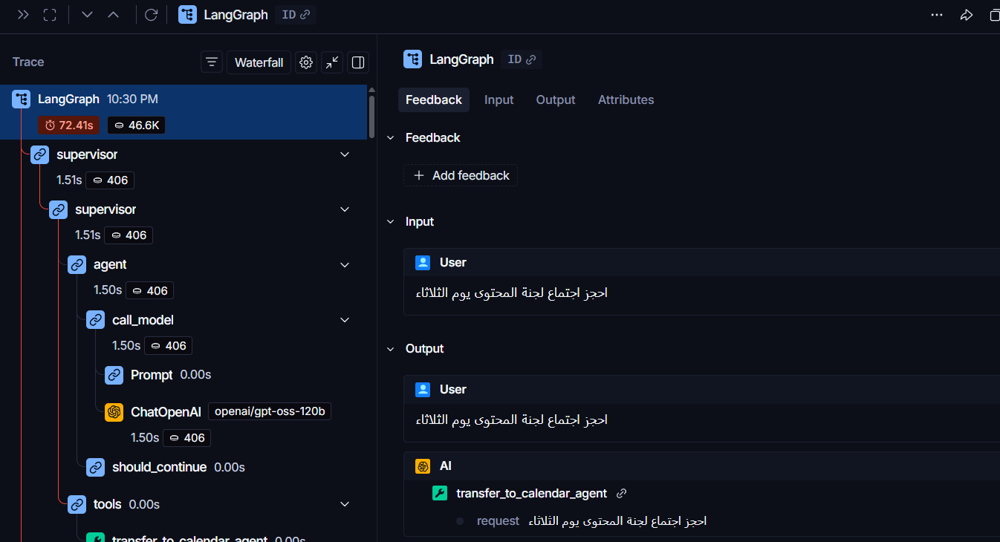
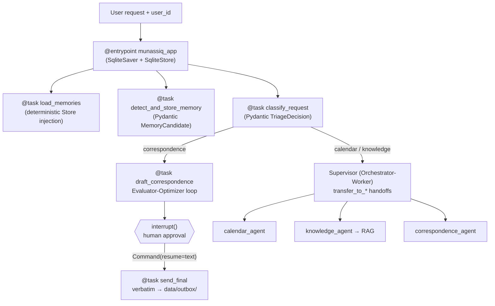

# Munassiq (المُنسِّق) — Association Office Assistant

     -yellow)

**Abdulaziz Khalid Mulia (عبدالعزيز خالد مُليا)** — [@AK7Amin](https://github.com/AK7Amin)

SDAIA Academy — *Building AI Agent Systems*, cohort **16–20 August 2026**, Riyadh.
Capstone **Track A: Supervisor + Workers** · [SDAIA Academy on GitHub](https://github.com/SDAIAAcademy)

## Team

| Role | Name |
|---|---|
| Leader | **Abdulaziz Khalid Mulia** |
| Member | Ali Asiri |
| Member | Faisal Abdullah Alhaqbani |
| Member | Moayad Abdullah Badahdah |
| Member | Ali Taha Alsahad |
| Member | Zaid Aldossari |

A multi-agent office assistant for a non-profit association: a supervisor routes
every request to one of three specialist workers (knowledge, calendar,
correspondence), answers policy questions from an Arabic document base through a
real RAG pipeline, remembers member preferences **across conversation threads**,
and **pauses for human approval** before anything irreversible leaves the
building — with durable state that survives a process restart.

> ⚠️ **All documents under `data/corpus/` are synthetic**, authored solely for
> this training project. They represent no real organization. No real e-mail is
> ever sent — the correspondence worker writes to a local outbox directory.

---

## For the grader — where every rubric section is proven

| # | Rubric section | Implementation | Notebook section | Test |
|---|---|---|---|---|
| 1 | Agent fundamentals — real tool calls + structured output | `src/munassiq/tools.py` (`create_event`, `save_email_draft`, Pydantic `TriageDecision` via `with_structured_output`) | §1 | `tests/test_tools.py` |
| 2 | Multi-agent routing — the **LLM** decides | `src/munassiq/supervisor.py` (`langgraph-supervisor`; printed `transfer_to_*` calls) | §2 | `tests/test_supervisor.py` |
| 3 | RAG pipeline — load → split → embed → store → retrieve | `src/munassiq/rag.py` (multilingual MiniLM via fastembed, Chroma) + written 2-Step vs Agentic vs Hybrid justification | §3 | `tests/test_rag.py` |
| 4 | Context & state — checkpointer + **separate Store**, cross-thread proof | `src/munassiq/memory.py` (`SqliteSaver` + `SqliteStore`, both on disk) | §4 | `tests/test_memory.py` |
| 5 | Human-in-the-loop — `interrupt()` **and** `Command(resume=...)` | `src/munassiq/app.py` (pause before send; resume text used verbatim) | §5 | `tests/test_hitl.py` |
| 6 | Functional API + ≥2 error strategies | `@task`/`@entrypoint` throughout; `RetryPolicy` (transient) + LLM-recoverable correction loop | §6 | `tests/test_reliability.py` |
| 7 | Workflow pattern — implemented **and named** | **Evaluator-Optimizer** inside the correspondence path; the supervisor itself is **Orchestrator-Worker** | §7 | `tests/test_reliability.py` |
| 8 | LangSmith observability | `src/munassiq/tracing.py` (guards the exact `LANGCHAIN_TRACING_V2` name; polling verifier) | §8 | `tests/test_tracing.py` |

The end-to-end acceptance test is `tests/test_integration.py::test_capstone_end_to_end`.

### Evidence from the live LangSmith traces

Cross-thread long-term memory — the `munassiq_app` task tree, with the fact
written in one thread surfacing in `memories_used` on a **different** thread:



Supervisor routing — the LLM's own `transfer_to_calendar_agent` handoff and
the worker's round trip, visible in the trace tree:



## Architecture



Design rules enforced by tests: the entrypoint body is pure glue (every LLM
call and side effect lives inside a `@task`, so nothing re-executes on resume);
the human's resume text reaches the outbox **without passing through any
model**; memories are injected deterministically rather than left to the
model's discretion.

## Running it

```bash
python -m venv .venv && .venv/Scripts/activate   # Windows
pip install -r requirements.txt
copy .env.example .env                            # then fill your keys
pytest -m "not api and not langsmith"             # 28 pure-local tests — no network at all
pytest -m langsmith                               # +3 LangSmith connectivity (needs LANGSMITH_API_KEY)
pytest                                            # full 40 (live LLM + LangSmith)
# On a machine with NO keys: plain `pytest` still works — 27 pass, the rest
# skip gracefully with a labelled reason (keys are an environment concern,
# never a hidden test failure).
jupyter notebook munassiq_capstone.ipynb          # run top-to-bottom from the repo root
```

- Model: `openai/gpt-oss-120b` — served by Groq by default; the committed
  evidence run used the same model via OpenRouter after Groq's free daily
  quota ran out (`MUNASSIQ_PROVIDER=openrouter`; override model with
  `MUNASSIQ_MODEL`). The swap and its trade-offs are documented in
  `docs/WRITEUP-DRAFT.md`.
- Tracing: `LANGCHAIN_TRACING_V2=true` — note the exact name; the common
  misspelling `LANGSMITH_TRACING_V2` fails **silently** and our config guards
  against it.
- Before any push: `python tools/leak_scan.py` must exit 0 (scans the raw
  notebook and every tracked file for key patterns, absolute paths, and the
  machine username).

## Reliability

| Error class | Strategy | Where |
|---|---|---|
| Transient (network, 5xx) | Real `RetryPolicy(max_attempts=3)` on the task — no hand-rolled sleep loops | `workers.py::fetch_external_resource` |
| LLM-recoverable (bad tool input) | Error text fed back to the model in a correction message, bounded retries | `workers.py::run_tool_with_llm_recovery` |
| User-fixable | `interrupt()` — the approval gate doubles as the pattern | `app.py` |
| Unexpected | Propagate for debugging; displayed as `ExceptionType: message` only (no raw tracebacks in notebook output) | throughout |

## How it was built

Test-driven, in vertical slices: every slice landed as a **red commit** (the
failing test, its first failure line in the commit message) followed by a
**green commit** (minimal implementation). Risky assumptions were burned down
first by throwaway spikes run against the real APIs — which is how we caught
that the course's `llama-3.3-70b-versatile` returns 404 on this account
(replaced with `openai/gpt-oss-120b`) and that the default English embedding
model silently fails on Arabic text (replaced with
`sentence-transformers/paraphrase-multilingual-MiniLM-L12-v2`, running locally
via fastembed/ONNX — no key, no cost). A four-angle plan critique
(architecture, rubric compliance, security, reliability) ran before the first
line of implementation; its decisions are recorded in `docs/plan/`.

## Repository layout

```
munassiq/
├── munassiq_capstone.ipynb      # the graded notebook — one evidence section per rubric row
├── src/munassiq/                # config · tools · rag · workers · supervisor · memory · app · tracing
├── tests/                       # 40 tests; `-m "not api"` runs the 31 offline ones
├── tools/                       # leak_scan.py (pre-push gate) · verify_trace.py
├── data/corpus/                 # 3 synthetic Arabic policy documents (planted verbatim facts)
├── docs/                        # WRITEUP-DRAFT.md · SUBMISSION-CHECKLIST.md · plan/ (PRD, run log, critique)
└── requirements.txt
```

## Known limits

- **Composite requests are two turns, by design.** "Search the policies AND
  e-mail the summary" in one message hits a deliberate wall: the drafting path
  has no retrieval tool, and the supervisor path cannot send. The strict split
  isolates the send behind the single human gate. The documented evolution:
  inject `search_policies` results deterministically into `compose_draft`
  (the same pattern used for memory injection) — without ever giving the
  send authority to a model.

- **Groq free tier**: 200K tokens/day/model and 8K tokens/minute — the `api`
  marker exists so the offline suite stays runnable when the quota is spent.
- The evaluator loop is capped at two rounds; correspondence quality beyond
  that is the human approver's call by design.
- `SqliteStore` gives durable cross-thread memory on one machine; a
  multi-instance deployment would swap in `PostgresStore` (course Day-5
  production lesson) — see *Not built*.

## Possible improvements (noted, deliberately deferred)

- **Retrieval evaluation metrics** (recall@k / RAGAS-style faithfulness) on the
  planted-fact corpus — the verbatim-fact test covers correctness today;
  metrics would add graded quality tracking.
- **Circuit breaker / client-side rate-limit guard** around provider calls —
  today RetryPolicy + structured-output retries + test-level reruns absorb
  the observed failure modes.
- **Deterministic retrieval injection into the drafting path** — the evolution
  already documented under Known limits.

## Not built (declared honestly)

No FastAPI serving layer, no UI, no real e-mail transport, no deployment — the
capstone rubric does not ask for them and nothing here pretends they exist.
The production lesson's path (durable Postgres state + `/ask`, `/approve`
endpoints) is documented in `docs/WRITEUP-DRAFT.md` as future work.

## License & attribution

Educational capstone for SDAIA Academy. Course material:
[Building Agentic AI Systems](https://mohammadyusif.github.io/agentic-ai-systems/)
(Hassan Algoz, extended by Mohammad Yusif). All synthetic documents and code
authored for this submission.
